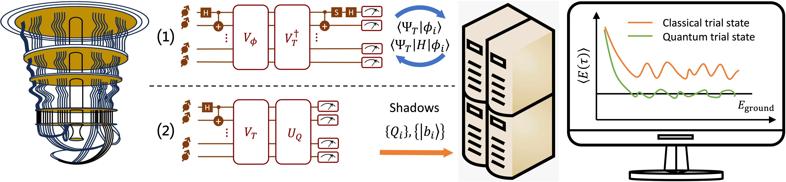

# Quantum Classical-Auxilary field Quantum Monte Carlo

## Introduction

This repository contains open-source code and tutorials for performing hybrid quantum-classical quantum Monte Carlo simulations for finding the ground state of the hydrogen molecule. This algorithm has the potential for realizing accuracy benefits over its purely classical counterpart when scaled up. 

In recent years, this algorithm has attracted attention from both academia and industry, and several variants have been proposed [1-6]. Broadly speaking, these variants differ in how the overlap amplitude $\langle\Psi_T|\phi\rangle$ is evaluated, where $|\Psi_T\rangle, |\phi\rangle$ represent the quantum trial state and classical walker state, respectively. 

* Ref.[1] employs a Hadamard-test type circuits, namely vacuum reference circuits, to evaluate the overlap. This implementation requires iterative communication between the quantum and classical hardware, as the overlap (and local energy) of the walker states are needed every timestep. This approach has a relatively low scaling in both the quantum $\sim O(N^4)$ and classical resources $\sim O(N^3)$, but a rather large prefactor in the number of circuits to be executed and therefore less suitable for near-term quantum hardware.
* Ref.[2-4] employ shadow tomography and don't require iterative communication between the quantum and classical hardware. In addition, this approach exhibits an intrinsic noise robustness, meaning no error mitigation required for obtaining "good" results. This makes the second approach more suitable for near-term quantum hardware.

A schematic workflow of the QC-AFQMC algorithm is depicted below.

The two quantum circuit diagrams represent the vacuum reference (1) and Matchgate shadow circuit (2), respectively. For the latter method, we employ the following code by Andrew Zhao: [fermionic-classical-shadows](https://github.com/zhao-andrew/symmetry-adjusted-classical-shadows) to construct the Matchgate circuits.

## How to use this repo

We explore both aforementioned approaches of QC-AFQMC in this repo, allowing you to make a comparison and have a better understanding of the pros and cons of each method. Our implementations are primarily based on Ref.[1,4]. The notebooks are organized as follows:

* 1_vacuum_reference.ipynb - This notebook contains a general introduction to QC-AFQMC, the motivation and how it compares to the classical AFQMC. For the quantum component, we explore the vacuum reference circuit approach to evaluate the overlap and local energy of walkers.
* 2_matchgate_shadow.ipynb - This notebook investigates the shadow tomography approach to evaluate the overlap and local energy on classical computers.

## References

1. Xu, Xiaosi, and Ying Li. "Quantum-assisted Monte Carlo algorithms for fermions." [arXiv:2205.14903 (2022)](https://arxiv.org/abs/2205.14903).
2. Huggins, William J., et al. "Unbiasing fermionic quantum Monte Carlo with a quantum computer." [Nature 603.7901 (2022): 416-420](https://www.nature.com/articles/s41586-021-04351-z).
3. Wan, Kianna, et al. "Matchgate Shadows for Fermionic Quantum Simulation." [Communications in Mathematical Physics 404.2 (2023): 629-700](https://link.springer.com/article/10.1007/s00220-023-04844-0).
4. Huang, Benchen, et al. "Evaluating a quantum classical quantum Monte Carlo algorithm with Matchgate shadows." [Physical Review Research 6.4 (2024): 043063](https://journals.aps.org/prresearch/abstract/10.1103/PhysRevResearch.6.043063)
5. Jiang, Tong, et al. "Unbiasing fermionic auxiliary-field quantum Monte Carlo with matrix product state trial wavefunctions." [Physical Review Research 7.1 (2025): 013038](https://journals.aps.org/prresearch/abstract/10.1103/PhysRevResearch.7.013038).
6. Zhao, Luning, et al. "Quantum-Classical Auxiliary Field Quantum Monte Carlo with Matchgate Shadows on Trapped Ion Quantum Computers." [arXiv:2506.22408 (2025)](https://arxiv.org/abs/2506.22408)
